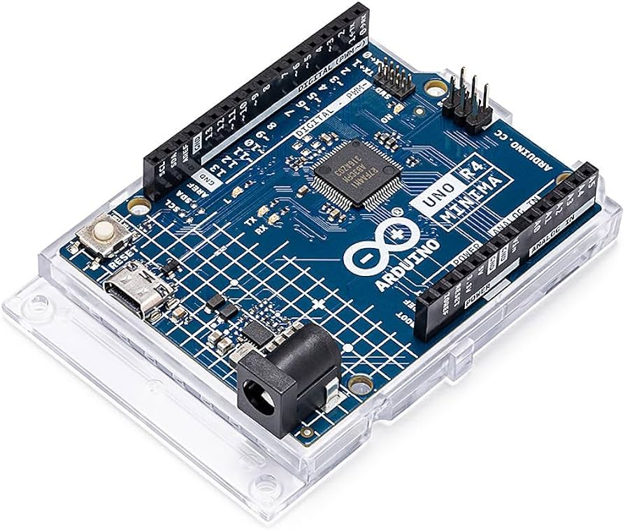
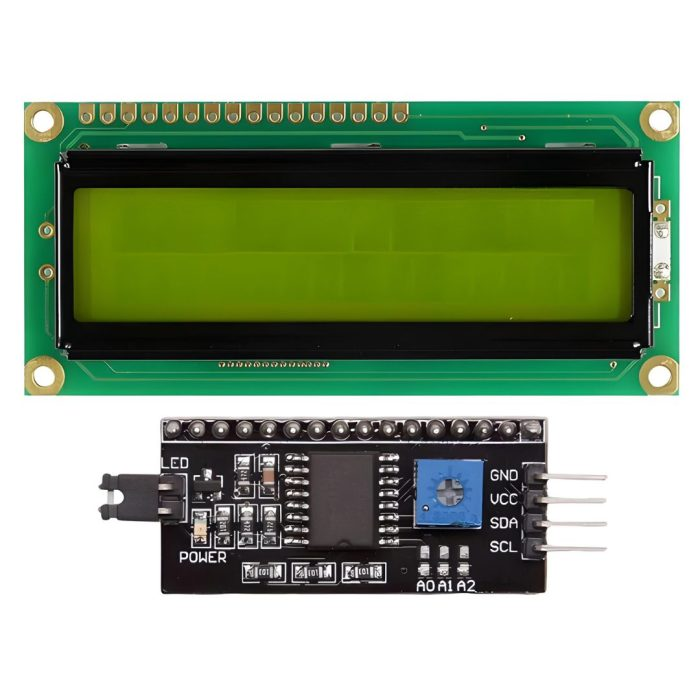
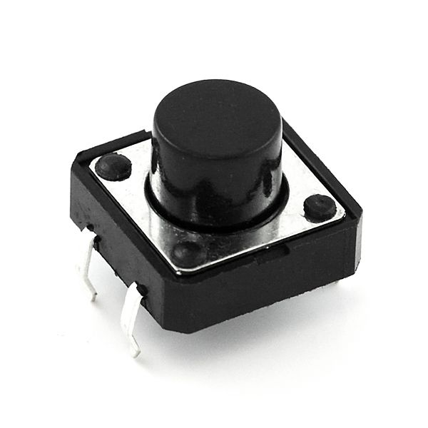
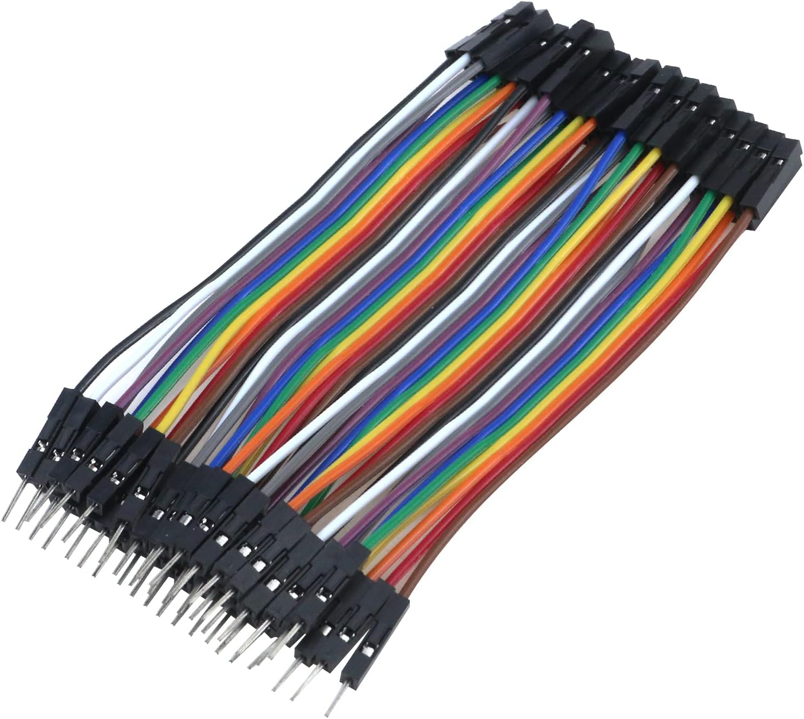

# FlappyChick
📌 Project นี้เป็นส่วนหนึ่งในรายวิชา PHYSICAL COMPUTING 06016409 ภาคเรียนที่ 1 ปีการศึกษา 2567 ของคณะเทคโนโลยีสารสนเทศ สาขาเทคโนโลยีสารสนเทศ สถาบันเทคโนโลยีพระจอมเกล้าเจ้าคุณทหารลาดกระบัง

# บทคัดย่อ
Project นี้เป็นการบูรณาการในการใช้งาน Microcontroller ในรายวิชา PHYSICAL COMPUTING โดยเป็นการทำเป็นเกมที่สนุกและโต้ตอบได้ โดยผู้เล่นจะควบคุมไก่เพื่อให้บินผ่านสิ่งกีดขวางที่ปรากฏบนหน้าจอที่เลื่อนอย่างต่อเนื่อง โดยเกมนี้ได้รับแรงบันดาลใจจากเกม Flappy Bird และมีความพิเศษที่ใช้ตัวละครเป็นไก่แทน นอกจากนี้ เกมนี้สร้างขึ้นทั้งหมดโดยใช้อุปกรณ์ฮาร์ดแวร์ของ Arduino ผู้เล่นจะต้องกะจังหวะการเคลื่อนไหวให้แม่นยำเพื่อหลีกเลี่ยงการชนกับสิ่งกีดขวางและทำคะแนนสูงสุด โดยจะมีอุปกรณ์ที่ใช้งานใน Project ดังกล่าวทั้งหมดดังนี้

# อุปกรณ์ที่ใช้งาน
* Arduino UNO R4

* LCD

* Button

* Jumper Wires

* Breadboard

# ฟังก์ชันหลัก
* ระบบควบคุมการกระโดดของไก่และการเคลื่อนที่ของท่อ โดยไก่จะกระโดดเมื่อกดปุ่ม และถูกแรงโน้มถ่วงดึงลงเมื่อไม่ได้กดปุ่ม
* ระบบตรวจสอบการชนกับท่อหรือขอบหน้าจอ หากเกิดการชนจะสิ้นสุดเกมทันที
* ระบบแสดงคะแนนเมื่อไก่ผ่านท่อสำเร็จ สามารถแสดงผลคะแนนบนหน้าจอ LCD ให้ผู้เล่นเห็นตลอดการเล่น

# Website

# Demo Video

# Member
* 66070156 นายภานุพงษ์ ฝ่อกระโทก
* 66070161 นายภูฟ้า มันทรานนท์
* 66070207 นายสิวะภัทร์ สมานตระกูลชัย
* 66070221 นางสาวอลิสรา ตั่นเล่ง
